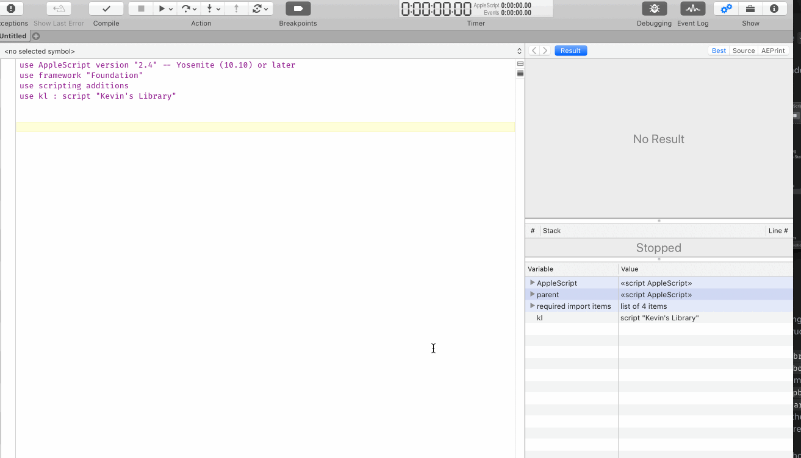

# Alfred

Various scripts for Alfred use.

> Although not needed, the shortcut keys I use to execute these via [Keyboard Maestro][kmapp] or [Alfred][alfredapp] are included in case you're interested

## Contents

- [Show Recent Files for Front App][f87hsj34]&emsp;<kbd>hyperkey</kbd><kbd>O</kbd>&emsp; :earth_americas:
    - Super useful and great when set as a keyboard shortcut, check out the demo below.

    

- [Browse Current Workflow in Alfred][6274c240]&emsp;<kbd>⌘</kbd><kbd>R</kbd>
    - Great way to get to the files of the workflow you are looking at quickly.

[f87hsj34]: ./Show-Recent-Files-for-Front-App.applescript
[6274c240]: ./Browse-Current-Workflow-in-Alfred.applescript
[kmapp]: https://www.keyboardmaestro.com/
[alfredapp]: https://www.alfredapp.com/
