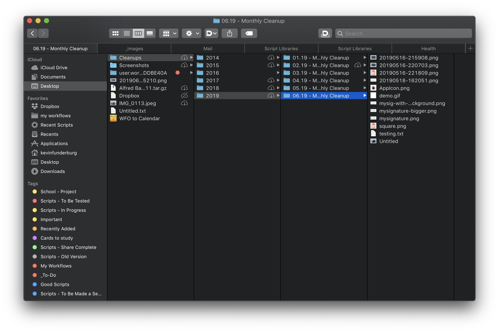

# Finder scripts

Various scripts for use in Finder.

> Although not needed, the shortcut keys I use to execute these via [Keyboard Maestro][kmapp] or [Alfred][alfredapp] are included in case you're interested

## Contents

- [Copy Path as Alias][02e5746e]&emsp;<kbd>⌘</kbd><kbd>⌃</kbd><kbd>C</kbd>
  - Copies the current Finder selection as a alias for scripting
  - Result looks like

    ```AppleScript
    "Macintosh HD:Users:kevinfunderburg:Desktop:README.md" as alias
    ```

- [Go to Custom Folder][fb40138e]&emsp;<kbd>too many to list</kbd>
  - Script that lets you jump to any folder you like in an instant, works exactly like the `Finder` > `Go` menu, but you add your favorite folders.
  - I use this script for about 8 different folders that I'm constantly in and out of.
  - **How to** - Duplicate the script for each folder you want, and update the `t` variable to the HFS path of the folder you want.

- [Monthly Cleanups][cfd2fea0]
  - Clean up old files in `~/Downloads` or `~/Desktop` by consolidating files > 2 weeks old into a folder with a path like `~/Desktop/Cleanups/[year]/[month].[year] - Monthly Cleanups`.
  - I've used this method for years to keep these folders tidy and I love it, here's an example of what the result looks like.
  
  - I generally use [Hazel](https://www.noodlesoft.com/) to execute this script automatically, but it can be run via the Script Menu, or through the command line using

    ```shell
    osascript 'Monthly Cleanups.scpt' "desktop"
    ```

- [Open Selection in iTerm][e928def2]&emsp;<kbd>⌥</kbd><kbd>⇧</kbd><kbd>T</kbd>
  - Open [iTerm](https://www.iterm2.com/) and change directory to the current location in Finder. Super useful if you are on the command-line a lot.
    

[02e5746e]: ./Copy-Path-as-Alias.applescript
[fb40138e]: ./Go-to-Custom-Folder.applescript
[cfd2fea0]: ./Monthly-Cleanups.applescript
[e928def2]: ./Open-Selection-in-iTerm.applescript

[kmapp]: https://www.keyboardmaestro.com/
[alfredapp]: https://www.alfredapp.com/
