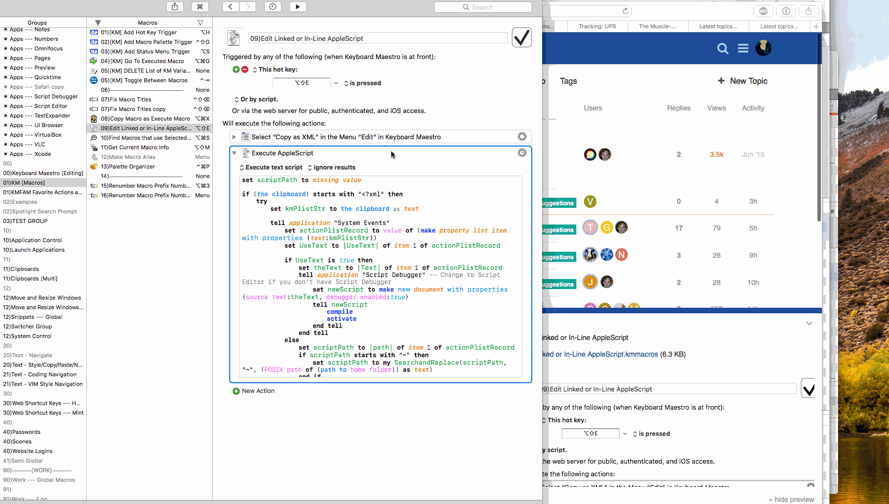
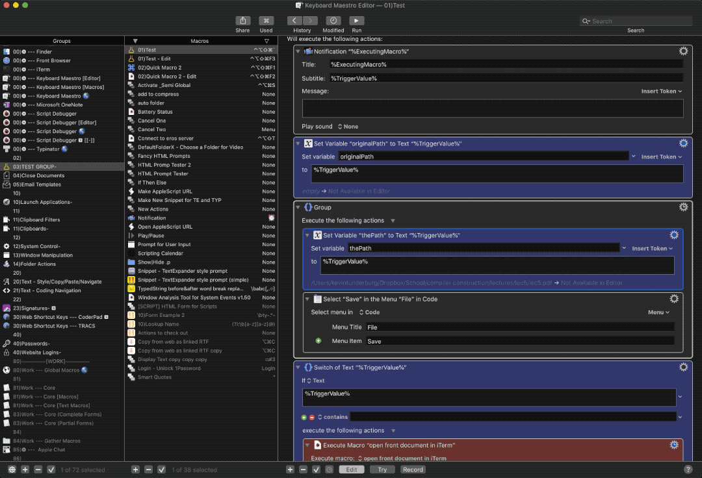
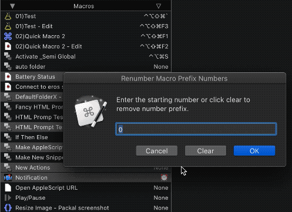

<p align="center">

</p>

# Keyboard Maestro Scripts

Scripts for use while working in [Keyboard Maestro][kmapp].
> Although not needed, the shortcut keys I use to execute these via [Keyboard Maestro][kmapp] or [Alfred][alfredapp] are included in case you're interested

## Contents

- [Edit Linked or In-Line AppleScript][c02bcb30]&emsp;<kbd>⌥</kbd><kbd>⇧</kbd><kbd>E</kbd>
  - When you trigger this script, it will determine if the action copied is an
    in-line or linked AppleScript and open the result in your preferred AppleScript
    editor (default is Script Debugger).
  - If it is in-line, it will compile the text in your editor
  - Check out the demo below.<br>
    

- [Add|Remove Status Menu Trigger][c2d0b8f9]&emsp;<kbd>⌥</kbd><kbd>S</kbd>
  - Quickly add or remove a status menu trigger, best when mapped to a shortcut key.

- [Collapse All [Pause|Type|Execute|Cancel|Paste|Delete|Menu] Actions][a0794034]&emsp;<kbd>⌥</kbd><kbd>⌃</kbd><kbd>[</kbd>
  - I like to keep these actions collapsed to keep my macros neat: `Type Text`, `Pause for`, `Execute Macro`, `Type the keystroke`, `Notification`, `Cancel`, `Paste from Named Clipboard`, `Delete Past Clipboard`, `Select Menu Item`, `Set Variable`
  - This script makes this easy by using the script [Recursively Get Every Action][jf9jsn87] then collapsing them for me
  - Demo:
  

- [Copy Front Macros AppleScript Trigger][d4cdec98]&emsp;<kbd>⌘</kbd><kbd>⌃</kbd><kbd>C</kbd>
  - Copies the AppleScript trigger for the front macro without having to show the script snippet, best when mapped to a shortcut key.
  - Result looks like:
  
    ```AppleScript
    # ignoring application responses
    tell application "Keyboard Maestro Engine"
            do script "97A494D2-4988-4B66-853F-D72C028197D8"
            # or: do script "97A494D2-4988-4B66-853F-D72C028197D8" with parameter "Whatever"
    end tell
    # end ignoring
    ```

- [Edit Last Executed Macro][2f47df90]&emsp;<kbd>⌃</kbd><kbd>⇧</kbd><kbd>E</kbd>&emsp; :earth_americas:
  - Global script that shows the last executed macro, great when an edit needs to be made after execution.

- [Edit Macro Group of Front App][bca5fefd]&emsp;<kbd>⌘</kbd><kbd>⌥</kbd><kbd>K</kbd>&emsp; :earth_americas:
  - Quickly jump to the macro group of the app you're currently in.

- [Go To Executed Macro][8f04478c]&emsp;<kbd>⌘</kbd><kbd>⌥</kbd><kbd>G</kbd>
  - Jump to the macro being called within a macro by the `Execute Macro` action.

- [Recursively Get Every Action][jf9jsn87]
  - This is a useful subroutine to get _every_ action of the front macro, even those nested within if/else statements, switch statements, groups, etc.

- [Renumber Macro Number Prefix][7037aad4]&emsp;<kbd>⌘</kbd><kbd>⌃</kbd><kbd>3</kbd>
  - Batch rename macros to give them ordered number prefixes, or clear the prefixes altogether.
  

- [Run Current Macro](./Run-Current-Macro.applescript)&emsp;<kbd>⌘</kbd><kbd>⌃</kbd><kbd>R</kbd>&emsp; :earth_americas:
  - Crucial action, I use it all the time to test out the macro I'm working on but haven't set a trigger for it yet.


[kmapp]: https://www.keyboardmaestro.com/
[alfredapp]: https://www.alfredapp.com/
[c2d0b8f9]: ./Add|Remove-Status-Menu-Trigger
[d4cdec98]: ./Copy-Front-Macros-AppleScript-Trigger.applescript
[c02bcb30]: ./Edit-Linked-or-In-Line-AppleScript.applescript
[2f47df90]: ./Edit-Last-Executed-Macro.applescript
[bca5fefd]: ./Edit-Macro-Group-of-Front-App.applescript
[8f04478c]: ./Go-To-Executed-Macro.applescript
[jf9jsn87]: ./Recursively-Get-Every-Action.applescript
[7037aad4]: ./Renumber-Macro-Prefix-Numbers.applescript
[a0794034]: ./Collapse-All-[Pause|Type|Execute|Cancel|Paste|Delete|Menu]-Actions.applescript
