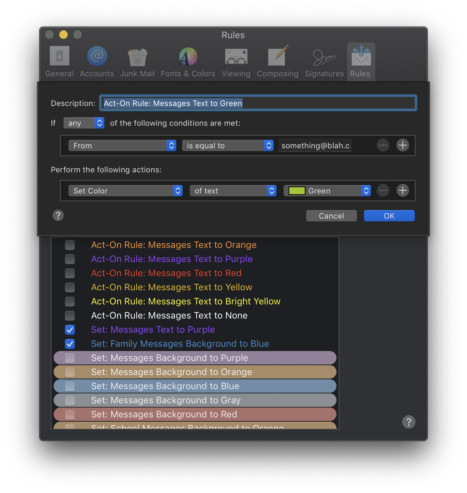
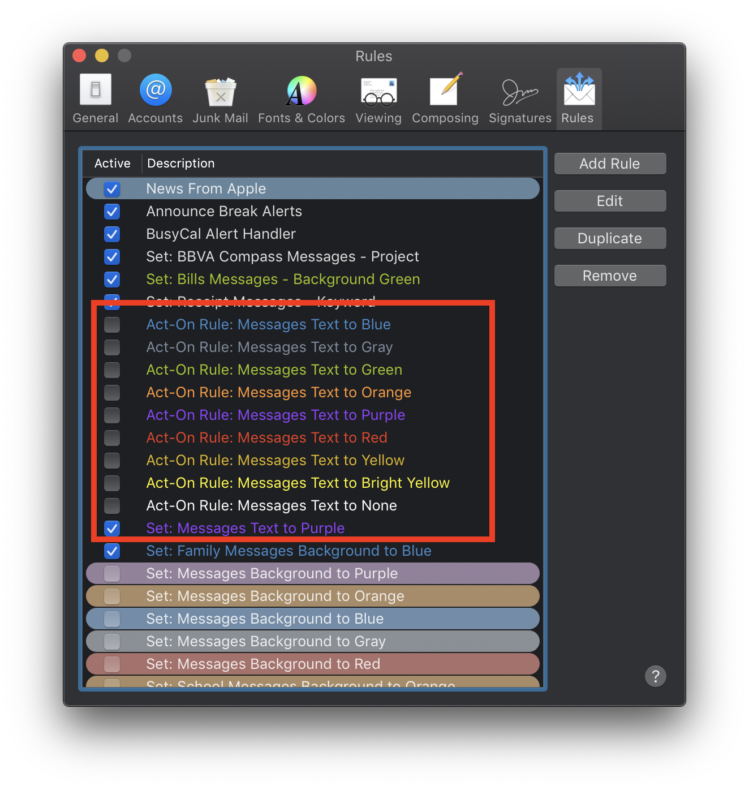
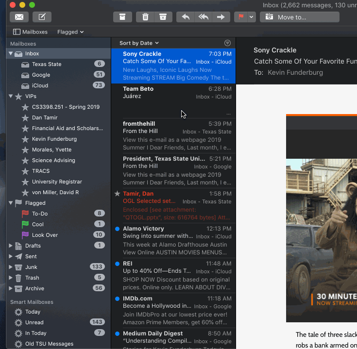
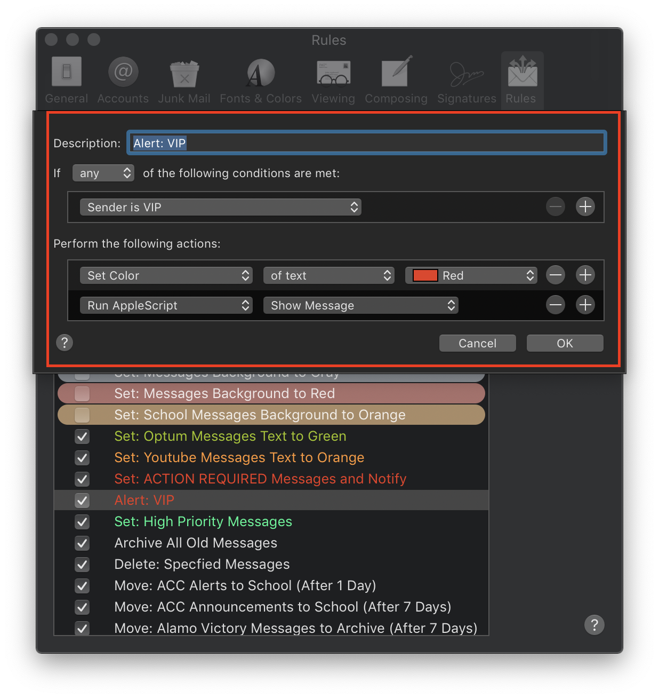

# Mail Scripts

Scripts for supercharging Mail.

## Contents

- [Set Color of Text][djka87dj]
  - This script was made after Dark Mode was introduced on Mojave. I used to set the background color of messages to color code everything, but in Dark Mode, setting the color of text is much sexier. But for some reason, text color is not settable through the Mail scripting language.
  - To get around this lack of language, this script acts as a temporary rule that sets the color of the currently selected message(s) once and disables itself so it doesn't keep coloring messages. So in order for this to work, you have to make a rule for each color manually , and each rule must be named **exactly like this format**: `Act-On Rule: Messages Text to [<color>]`(screen shot below)
  

  - The `From` field will be reset every time the script is called so just set it to gibberish, but it **can't be blank or it won't save**,
  

  - After the rules are made the script can be ran by passing in the color you want to make the message (demo below).
  

  - I have each color mapped to a shortcut key in Keyboard Maestro like <kbd>⌘</kbd><kbd>⇧</kbd><kbd>B</kbd> for Blue, <kbd>⌘</kbd><kbd>⇧</kbd><kbd>R</kbd> for Red etc.
      > If you don't have Keyboard Maestro, just duplicate thi script for each color naming the file like `set text to [<color>]` and erase the first 3 lines and replace it with `set thecolor to [<color>]` then put each script into `~/Library/Scripts/Applications/Mail` an execute via the Script Menu

- [Make Mail URL][cnj3ds8l]
- [Mark All Inbox Messages as Read][dj28346f]
- [Show Message][9c348c76]
    - This script is used in conjunction with Mail rules to open and show an email
    message. Particularly useful for messages that are important that you don't
    want to miss.
    - My main rule that uses this is my VIP rule (screenshot below):
    

    - _NOTE_: For a rule script to work it must be placed in: `~/Library/Application Scripts/com.apple.mail`

[dj28346f]: ./Mark-All-Inbox-Messages-as-Read.applescript
[cnj3ds8l]: ./Make-Mail-URL.applescript
[djka87dj]: ./Set-Color-of-Text.applescript
[9c348c76]: ./Show-Message.applescript
