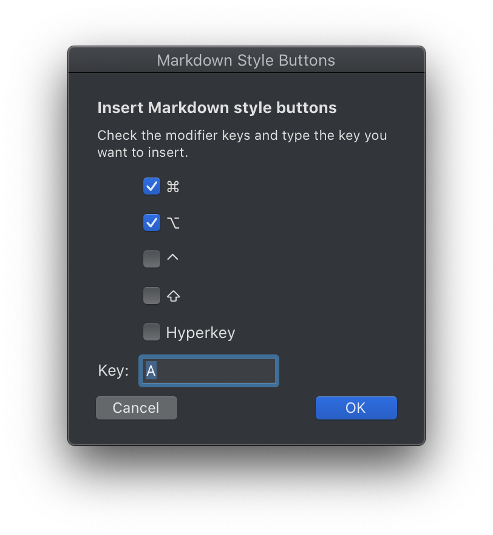

# Markdown Scripts

Various scripts for working with Markdown.

## Contents

- [Insert Markdown Style Buttons][b89f4ac4]&emsp;<kbd>⌥</kbd><kbd>H</kbd>
  - Makes inserting markdown style buttons nice and easy.
  - **Example**: Below is a screenshot of the window that appears when the script is run, the result will paste markdown style text that looks like: <kbd>⌘</kbd><kbd>⌥</kbd><kbd>A</kbd>
  

[b89f4ac4]: ./Insert-Markdown-Style-Buttons.applescript
