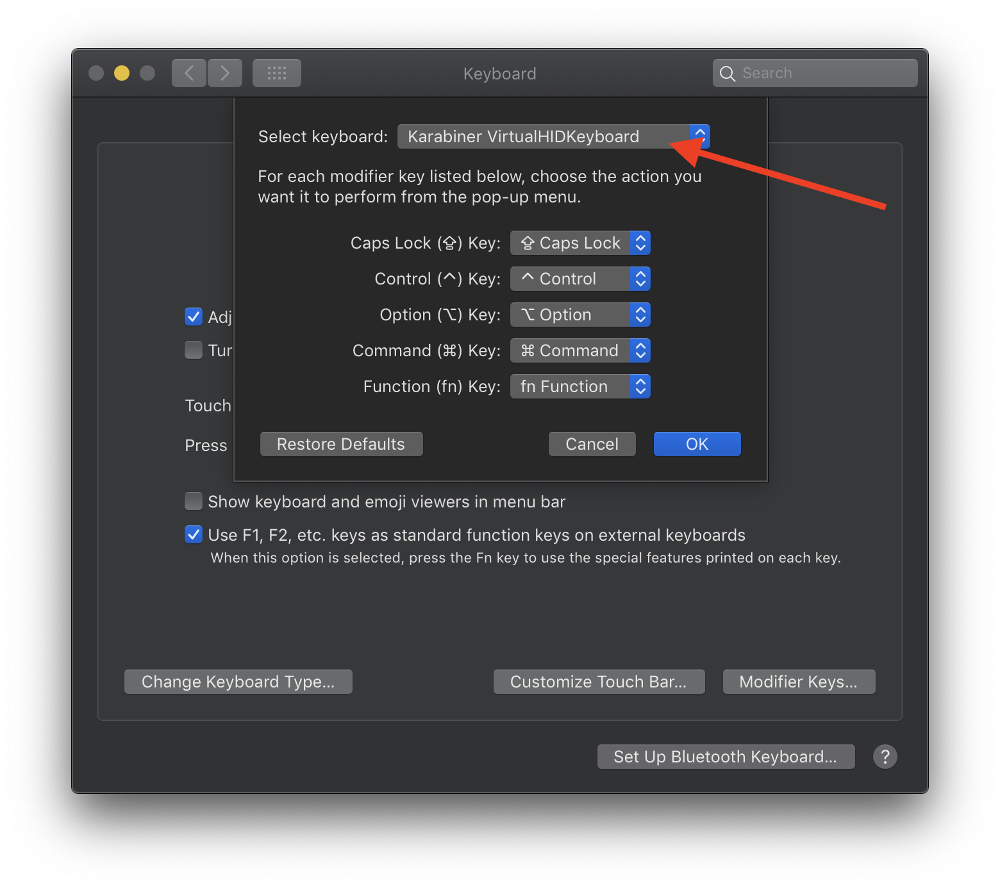
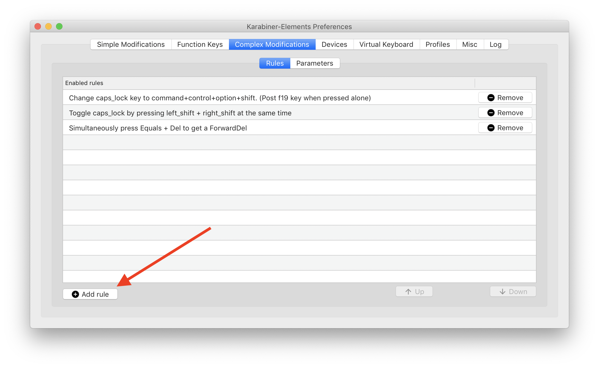

<p align="center">  </p>

# My AppleScripts

Collection of AppleScripts I've developed or acquired over the years. Some are great as standalone scripts while others are great for incorporation with others.

> This repo is in continuous development and will be updated as scripts are developed (and as I have time).

<details>
  <summary><strong>Table of Contents</strong> (click to expand)</summary>

<!-- TOC depthFrom:2 -->

- [About](#about)
- [Contents](#contents)
    - [Application Scripts](#application-scripts)
    - [Global Scripts](#global-scripts)
    - [Scripts for Script Development](#scripts-for-script-development)
- [Tools](#tools)
- [Tips](#tips)
    - [Keep Scripts In Sync Using Aliases](#keep-scripts-in-sync-using-aliases)
    - [Make a Hyperkey](#make-a-hyperkey)
- [Resources](#resources)
    - [My Favorite AppleScripters](#my-favorite-applescripters)
    - [My Favorite Tutorials](#my-favorite-tutorials)
- [Licensing & thanks](#licensing--thanks)
- [Changelog](#changelog)
- [To-Do](#to-do)

<!-- /TOC -->
</details>

<a id="about"></a>

## About

This repo was created for two main reasons.
1. Provide others with useful scripts for automating their workflow on macOS.
2. As a tool for AppleScript education by providing example scripts, tools, tips and AppleScript resources.

With some exceptions, almost all these scripts are executable by themselves via the [Script Menu][klsie781]. However, I generally turn to third party automation apps to execute them, including [Keyboard Maestro][kmapp], [Alfred][alfredapp], [BetterTouchTool][bttapp] and [Hazel][hazelapp].

- **Notes on formatting**
For those who are unaware, the standard file format for AppleScripts is `.scpt` or `.scptd`, but these file types are not readable on GitHub, so for readability's sake, all these scripts have been exported as a `.applescript` file (which is just a text file). So if you were wondering about the file type, this is the reason.

- Many of these scripts depend on this [script library][kevinslib] I developed, so if you see the following line at the top of the script, make sure you get that library and place it into `~/Library/Script Libraries` otherwise the script is non-functional.

```AppleScript
use kl : script "Kevin's Library"
```

## Contents

I've divided the scripts into 3 sections:
1. **Application Scripts** - Scripts designed for use in a specific application.
2. **Global Scripts** - Scripts that are meant to be executed in any application.
    - _NOTE_: There are scripts here that are specific to an application but are meant to executed globally, so the scripts in the Application Scripts section with the globe icon ( :earth_americas: ) next to them imply global scope for that specific application.
3. **Scripts for Script Development** - These scripts are useful handlers that can be copied into scripts or into a script library that makes scripting much simpler.

Clicking the name of the script will show you the script directly, but **make sure to view the README for each section** by clicking the title of the section to see instructions/explanations/demos.

> Although not needed, the shortcut keys I use to execute these via [Keyboard Maestro][kmapp] or [Alfred][alfredapp] are included in case your're interested


<a id="Application Scripts"></a>
### Application Scripts

Application                 |  Scripts                                            | <i></i>             |  Shortcut Key
----------------------------|-----------------------------------------------------|---------------------|--------------------------
**[Alfred][alf]**           |  [Show Recent Files for Front App][a345fg38]        | :earth_americas: :cinema:   | <kbd>hyperkey</kbd><kbd>O</kbd>
<i></i>                     |  [Browse Current Workflow in Alfred][6274c240]      | <i></i>             | <kbd>⌘</kbd><kbd>R</kbd>
<i></i>                     |  <i></i>                                            | <i></i>             | <i></i>
**[BetterTouchTool][btt]**       |  [BetterTouchTool Library][ej8172hf]           | <i></i>             | <i></i>
<i></i>                     |  <i></i>                                            | <i></i>             | <i></i>
**[Calendar][cal]**         |  [WFO to Calendar][d2c1694b]                        | :earth_americas:    | <i></i>
<i></i>                     |  <i></i>                                            | <i></i>             | <i></i>
**[Finder][finder]**        |  [Copy Path as Alias][02e5746e]                     | <i></i>             | <kbd>⌘</kbd><kbd>⌃</kbd><kbd>C</kbd>
<i></i>                     |  [Go to Custom Folder][fb40138e]                    | <i></i>             | <kbd>too many to list</kbd>
<i></i>                     |  [Monthly Cleanups][2f34cbb7]                       | :camera:            | <i></i>
<i></i>                     |  [Open Selection in iTerm][8fea9aa4]                | :cinema:            | <kbd>⌥</kbd><kbd>⇧</kbd><kbd>T</kbd>
<i></i>                     |  <i></i>                                            | <i></i>             | <i></i>
**[Keyboard Maestro][km]**  |  [Edit Linked or In-Line AppleScript][3034f6a6]     | :cinema:            | <kbd>⌥</kbd><kbd>⇧</kbd><kbd>E</kbd>
<i></i>                     |  [Add\|Remove Status Menu Trigger][8111e7c4]        | <i></i>             | <kbd>⌥</kbd><kbd>S</kbd>
<i></i>                     |  [Copy Front Macro's AppleScript Trigger][4945c497] | <i></i>             | <kbd>⌘</kbd><kbd>⌃</kbd><kbd>C</kbd>
<i></i>                     |  [Edit Last Executed Macro][8265051f]               | :earth_americas:    | <kbd>⌃</kbd><kbd>⇧</kbd><kbd>E</kbd>
<i></i>                     |  [Go To Executed Macro][4355277b]                   | <i></i>             | <kbd>⌘</kbd><kbd>⌥</kbd><kbd>G</kbd>
<i></i>                     |  [Run Current Macro][8cbb891d]                      | :earth_americas:    | <kbd>⌘</kbd><kbd>⌃</kbd><kbd>R</kbd>
<i></i>                     |  <i></i>                                            | <i></i>             | <i></i>
**[Mail][mail]**            |  [Set Color of Text][d1529523]                      | :cinema: :camera:   | <kbd>⌘</kbd><kbd>⇧</kbd><kbd>(C)olor</kbd>
<i></i>                     |  [Make Mail URL][63ba2f90]                          | <i></i>             | <kbd>⌃</kbd><kbd>U</kbd>
<i></i>                     |  [Mark All Inbox Messages as Read][48cdab2f]        | :earth_americas:    | <i></i>
<i></i>                     |  [Show Message][9c348c76]                           | :earth_americas: :camera: | <i></i>
<i></i>                     |  <i></i>                                            | <i></i>             | <i></i>
**[OmniFocus][omnif]**      |  [Push Due Date][c82d4171]                          | <i></i>             | <kbd>⌥</kbd><kbd>D</kbd>
<i></i>                     |  [Set Duration][aaf5d91c]                           | <i></i>             | <kbd>⌥</kbd><kbd>⇧</kbd><kbd>1-9</kbd>
<i></i>                     |  <i></i>                                            | <i></i>             | <i></i>
**[Safari][saf]**           |  [Close Left Tab][6de3c825]                         | <i></i>             | <kbd>⌥</kbd><kbd>[</kbd>
<i></i>                     |  [Close Right Tab][2f774cb3]                        | <i></i>             | <kbd>⌥</kbd><kbd>]</kbd>
<i></i>                     |  [Duplicate Tab][74151e54]                          | <i></i>             | <kbd>⌃</kbd><kbd>D</kbd>
<i></i>                     |  [Do Javascript Handler][3d850154]                  | <i></i>             | <i></i>
<i></i>                     |  [Show\|Create Tab][225bf283]                       | <i></i>             | <i></i>
<i></i>                     |  <i></i>                                            | <i></i>             | <i></i>
**[Script Debugger][sdb]**  |  [Duplicate Tab][ff203baf]                          | <i></i>             | <kbd>F7</kbd>
<i></i>                     |  [Handler Tester][9b6bdfdc]                         | <i></i>             | <kbd>F6</kbd>
<i></i>                     |  [Insert Dynamic Handler Description][h78j5f3s]     | :cinema:            | <i></i>
<i></i>                     |  [Open Used Script Libraries][3c961777]             | <i></i>             | <kbd>⌃</kbd><kbd>⌥</kbd><kbd>O</kbd>
<i></i>                     |  [Run Front Script][u76g4ds3]                       | :earth_americas:    | <kbd>hyperkey</kbd><kbd>R</kbd>
<i></i>                     |  [Duplicate for GitHub][ea9fb946]                   | <i></i>             | <i></i>
<i></i>                     |  [Save As Text Script][98e99d57]                    | <i></i>             | <kbd>⌃</kbd><kbd>S</kbd>
<i></i>                     |  [Save a Copy of Front Script as Text][5ecfae32]    | <i></i>             | <kbd>⌃</kbd><kbd>S</kbd>
<i></i>                     |  [Toggle Minimal View][3a899b61]                    | <i></i> | <kbd>⌘</kbd><kbd>⌥</kbd><kbd>⇧</kbd><kbd>M</kbd>
<i></i>                     |  <i></i>                                            | <i></i>             | <i></i>
**[Typinator][typ]**        |  [Edit Last Expanded Rule][e918395c]                | :earth_americas: :camera: | <kbd>⌘</kbd><kbd>⌃</kbd><kbd>⌥</kbd><kbd>E</kbd>
<i></i>                     |  [New Snippet from Clipboard\|Selection][1172c96a]  | :earth_americas: | <kbd>⌘</kbd><kbd>⌃</kbd><kbd>⌥</kbd><kbd>N</kbd>


[alf]: ./Alfred
[a345fg38]: ./Alfred/Show-Recent-Files-for-Front-App.applescript
[6274c240]: ./Alfred/Browse-Current-Workflow-in-Alfred.applescript
[btt]: ./BetterTouchTool
[ej8172hf]: ./BetterTouchTool/BetterTouchTool-Library.applescript
[cal]: .Calendar
[d2c1694b]: ./Calendar/WFO-to-Calendar.applescript
[finder]: ./Finder
[02e5746e]: ./Finder/Copy-Path-as-Alias.applescript
[fb40138e]: ./Finder/Go-to-Custom-Folder.applescript
[2f34cbb7]: ./Finder/Monthly-Cleanups.applescript
[8fea9aa4]: ./Finder/Open-Selection-in-iTerm.applescript
[km]: ./Keyboard-Maestro
[3034f6a6]: ./Keyboard-Maestro/Edit-Linked-or-In-Line-AppleScript.applescript
[8111e7c4]: ./Keyboard-Maestro/Add|Remove-Status-Menu-Trigger.applescript
[4945c497]: ./Keyboard-Maestro/Copy-Front-Macros-AppleScript-Trigger.applescript
[8265051f]: ./Keyboard-Maestro/Edit-Last-Executed-Macro.applescript
[4355277b]: ./Keyboard-Maestro/Go-To-Executed-Macro.applescript
[8cbb891d]: ./Keyboard-Maestro/Run-Current-Macro.applescript
[mail]: ./Mail
[d1529523]: ./Mail/Set-Color-of-Text.applescript
[63ba2f90]: ./Mail/Make-Mail-URL.applescript
[48cdab2f]: ./Mail/Mark-All-Inbox-Messages-as-Read.applescript
[9c348c76]: ./Mail/Show-Messge.applescript
[omnif]: ./OmniFocus
[c82d4171]: ./OmniFocus/Push-Due-Date.applescript
[aaf5d91c]: ./OmniFocus/Set-Duration.applescript
[saf]: ./Safari
[6de3c825]: ./Safari/Close-Left-Tab.applescript
[2f774cb3]: ./Safari/Close-Right-Tab.applescript
[74151e54]: ./Safari/Duplicate-Tab.applescript
[3d850154]: ./Safari/Do-Javascript-Handler.applescript
[225bf283]: ./Safari/Show|Create-Tab.applescript
[sdb]: ./Script-Debugger
[ff203baf]: ./Script-Debugger/Duplicate-Tab.applescript
[ea9fb946]: ./Script-Debugger/Duplicate-for-GitHub.applescript
[9b6bdfdc]: ./Script-Debugger/Handler-Tester.applescript
[h78j5f3s]: ./Script-Debugger/Insert-Dynamic-Handler-Description.applescript
[3c961777]: ./Script-Debugger/Open-Used-Script-Libraries.applescript
[u76g4ds3]: ./Script-Debugger/Run-Front-Script.applescript
[98e99d57]: ./Script-Debugger/Save-As-Text-Script.applescript
[5ecfae32]: ./Script-Debugger/Save-a-Copy-of-Front-Script-as-Text.applescript
[3a899b61]: ./Script-Debugger/Toggle-Minimal-View.applescript
[typ]: ./Typinator
[e918395c]: ./Typinator/Edit-Last-Expanded-Rule.applescript
[1172c96a]: ./Typinator/New-Snippet-From-Selection|Clipboard.applescript

<a id="Global"></a>

### Global Scripts

Context                          |  Scripts                                              |  <i></i> | Shortcut Key
---------------------------------|-------------------------------------------------------|----------|-------------
**[Document Closers][c98jhawe]** |  [Close All Un-Saved Documents][9a704632]             | :camera: | <kbd>⌘</kbd><kbd>⌥</kbd><kbd>⇧</kbd><kbd>W</kbd>
<i></i>                          |  [Close All With Saving][3b80a0d2]                    | :camera: | <kbd>⌘</kbd><kbd>⌥</kbd><kbd>⇧</kbd><kbd>W</kbd>
<i></i>                          |  [Close All Without Saving][a5d8c9ea]                 | :camera: | <kbd>⌘</kbd><kbd>⌥</kbd><kbd>⇧</kbd><kbd>W</kbd>
<i></i>                          |  [Close With Saving][d370f17e]                        | :camera: | <kbd>⌥</kbd><kbd>W</kbd>
<i></i>                          |  [Close Without Saving][dec030b7]                     | :camera: | <kbd>⌃</kbd><kbd>W</kbd>
<i></i>                          |  <i></i>                                              | <i></i>  | <i></i>
**[System Control][sc]**         |  [Restart AirPort Extreme][456bc1d1]                  | <i></i>  | <i></i>
<i></i>                          |  [Toggle Bluetooth][25e6a902]                         | <i></i>  | <i></i>
<i></i>                          |  [Toggle Hazel][d2434bdc]                             | <i></i>  | <i></i>
<i></i>                          |  [Toggle Menu Bar Visibility][a517cb4f]               | <i></i>  | <i></i>
<i></i>                          |  [Toggle WiFi][aa8be569]                              | <i></i>  | <i></i>
<i></i>                          |  <i></i>                                              | <i></i>  | <i></i>
**[Various][global]**            |  [Click Script Menu][d1c0746f]                        | <i></i>  | <kbd>⌃</kbd><kbd>⇧</kbd><kbd>S</kbd>
<i></i>                          |  [Paste Safari URL With Title][1d8d603d]              | <i></i>  | <kbd>hyperkey</kbd><kbd>U</kbd>
<i></i>                          |  [Start\|Stop Quicktime Screen Recording][a921fa5d]   | <i></i>  | <kbd>⌃</kbd><kbd>⌥</kbd><kbd>Q</kbd>
<i></i>                          |  [Play\|Pause Apple TV][nh8765gf]                     | <i></i>  | <i></i>
<i></i>                          |  {++keychain access++}                                | <i></i>  | <i></i>

[c98jhawe]: ./Document-Closers
[9a704632]: ./Document-Closers/Close-All-Un-Saved-Documents.applescript
[3b80a0d2]: ./Document-Closers/Close-All-With-Saving.applescript
[a5d8c9ea]: ./Document-Closers/Close-All-Without-Saving.applescript
[d370f17e]: ./Document-Closers/Close-With-Saving.applescript
[dec030b7]: ./Document-Closers/Close-Without-Saving.applescript
[sc]: ./System-Control
[456bc1d1]: ./System-Control/Restart-AirPort-Extreme.applescript
[25e6a902]: ./System-Control/Toggle-Bluetooth.applescript
[a517cb4f]: ./System-Control/Toggle-Menu-Bar-Visibility.applescript
[d2434bdc]: ./System-Control/Toggle-Hazel.applescript
[aa8be569]: ./System-Control/Toggle-WiFi.applescript
[global]: ./Global
[d1c0746f]: ./Global/Click-Script-Menu.applescript
[1d8d603d]: ./Global/Paste-Safari-URL-With-Title.applescript
[a921fa5d]: ./Global/Start|Stop-Quicktime-Screen-Recording.applescript
[nh8765gf]: ./Global/Play|Pause-Apple-TV.applescript


### Scripts for Script Development

Context                         |  Scripts
--------------------------------|----------------------------------
**[Text Utilities][jh7839dm]**  |  [Extract Between][f3fd3ca9]
<i></i>                         |  [Search With Regex][4b6da3a9]
<i></i>                         |  [Split Text][561dd09a]
<i></i>                         |  [Transform Text][5748a92f]
<i></i>                         |  <i></i>
**File Utilities**            |  [Get File Metadata][jdksl139]
<i></i>                         |  <i></i>  |
**[Various][jsklandu]**         |  [Click at Mouse Location][jau3ndi8]


[jsklandu]: ./Script-Development
[jh7839dm]: ./Script-Development/Text-Utilities
[f3fd3ca9]: ./Script-Development/Text-Utilities/Extract-Between.applescript
[4b6da3a9]: ./Script-Development/Text-Utilities/Search-with-Regex.applescript
[561dd09a]: ./Script-Development/Text-Utilities/Split-Text.applescript
[5748a92f]: ./Script-Development/Text-Utilities/Transform-Text.applescript
[jdksl139]: ./Get-File-Metadata.applescript
[jau3ndi8]: ./Script-Development/Click-at-Mouse-Location.applescript

* * *

_Icon Key_

Icon                |  Meaning
--------------------|--------------------------------------------
:cinema:            | script has a gif demo in its section's README
:camera:            | script has a screenshot in its section's README
:tv:                | video to watch
:earth_americas:    | script is executed globally for a specific app

_Shortcut key symbols_

Symbol              | Key
--------------------|------------------
<kbd>⌘</kbd>        | <kbd>command</kbd>
<kbd>⌥</kbd>        | <kbd>option</kbd>
<kbd>⌃</kbd>        | <kbd>control</kbd>
<kbd>⇧</kbd>        | <kbd>shift</kbd>
<kbd>hyperkey</kbd> | <kbd>command</kbd> <kbd>option</kbd> <kbd>control</kbd> <kbd>shift</kbd>


* * *

## Tools

- **[Script Debugger](https://latenightsw.com/)** - By far the most valuable scripting tool. When I first started learning scripting with Script Editor, the process was slow and frustrating. With Script Debugger I learned 100 times faster and understood everything much easier.
- **[UI Browser](https://pfiddlesoft.com/uibrowser/)** - Invaluable tool for UI scripting. UI scripting is brutal on its own, and slightly less brutal with the Accessibility Inspector, but UI Browser makes it so much simpler, I tried it once and knew I had to get it.
- **[JSON Helper][vb5342sx]** - Makes working with JSON so much simpler, incredibly useful and **free**!
- **[Location Helper][f83kch8s]** - Find your geo code location in a snap, and for **free**!
- **[Dash](https://kapeli.com/dash)** - Fantastic tool for API browsing, after installation go to `Preferences` > `Downloads` and install the AppleScript docset to have blazing fast access to AppleScript documentation, plus its **free**!
- **[Atom Packages](https://atom.io/packages)** (I do all my script writing in Script Debugger but most of my Markdown stuff in [Atom](https://atom.io/) so these are very useful.)
    - [atom-applescript](https://github.com/franzheidl/atom-applescript) - adds language support to Atom so you can view AppleScript syntax
    - [build-osa](https://github.com/idleberg/atom-build-osa) - Lets you build and execute AppleScripts from Atom.
- **[Alfred Workflows][alfredapp]**
    - [AppScripts](https://github.com/deanishe/alfred-appscripts) - List, search and run/open AppleScripts for the active application
    - [KeyCodes](http://www.packal.org/workflow/keycodes) - Great for UI scripting where you need to type a non-character key. Lets you find AppleScript key codes in an instant by typing `kc [<key name>]`.
        - If you don't have Alfred then bookmark [Complete list of AppleScript key codes](https://eastmanreference.com/complete-list-of-applescript-key-codes)
- **[Keycue](https://www.ergonis.com/products/keycue/)** - I use this more for Keyboard Maestro, but it's a great app for quickly looking up keyboard shortcuts for macros or menu items.
* * *

## Tips

### Keep Scripts In Sync Using Aliases

In order for scripts to be accessible via the Script Menu, scripts must be stored in `~/Library/Scripts`, but if you like to keep your scripts synced between devices, this location is a pain. I used to have a [Hazel][hazelapp] rule set up to sync `~/Library/Scripts` to Dropbox that worked fine for years, but I didn't like all the extra processing needed to sync and worse yet I had 2 copies of every script which was messy and got confusing.


I realized later that moving all my scripts to `~/Dropbox/Library/Scripts` then creating an alias to that location and moving it `~/Library` allows for my scripts to be stored in Dropbox, and still be accessible in the Script Menu!
> This method works exactly as well with the `~/Library/Script Libraries` folder.

Here's a screenshot of what it looks like in Finder.


**How to do it:**

1.  **Make a backup** of the folder your moving to your Desktop just in case you mess up.
2.  I recommend having the same folder structure in Dropbox so make the folder `~/Dropbox/Library/`
3.  Copy the folder you want to sync (`~/Library/Scripts/` or `~/Library/Script Libraries/`) and paste into the `~/Dropbox/Library/` folder you made.
4.  Delete the original folder you copied from `~/Library/`
5.  Select the folder you pasted into `~/Dropbox/Library/` then click `File` > `Make Alias`
6.  Move the resulting alias back to `~/Library/`. The result will be like `~/Library/Scripts alias` so rename the alias by removing the " alias" part so it looks like `~/Library/Scripts` and you're good to go!

- **NOTE**: Symlinks don't work for this method, I originally tried the following command which did make an alias, but then the scripts weren't accessible via the Script Menu.

    ```shell
    ln -s ~/Library/Scripts ~/Dropbox/Library/Scripts/
    ```

### Make a Hyperkey
The <kbd>caps lock</kbd> key is a borderline useless key for a decent typist, but what's great about Macs is that we can change that. By a few adjustments in `System Preferences` and installing the free software [Karabiner](https://pqrs.org/osx/karabiner/), we can turn that useless key into a extremely useful <kbd>hyperkey</kbd>.

Hyperkey just means that the <kbd>caps lock</kbd> key will emulate holding down <kbd>⌘</kbd><kbd>⌃</kbd><kbd>⌥</kbd><kbd>⇧</kbd> at the same time, and since no application would use such a combination of keys to execute a command, this makes a whole new modifier key for us to implement.

**How to do it:**

1. Download [Karabiner](https://pqrs.org/osx/karabiner/)
2. Go to `System Preferences` > `Keyboard` and click on `Modifier Keys...` and make it look like this

3. Launch the `Karabiner-Elements` app
4. Click the `Complex Modifications` button and click the `Add Rule` button to install the hyperkey mod. You can see the mods I use below.



And that's it! Now you have the super useful <kbd>hyperkey</kbd>!

> Note that one of the mods I use to toggle <kbd>caps lock</kbd> is to click both <kbd>shift</kbd> keys at the same time for those rare cases when I need it.

* * *

## Resources
- [AppleScript Language Guide][ude4571a] - Necessary for efficient script development, explains everything about how to script with AppleScript. (I highly recommend the [Dash](https://kapeli.com/dash) version though, much faster and easier to use)
- [Macscripter.net](https://macscripter.net/) - Forum for AppleScripters to post examples and ask questions. Definitely create a free account.
- [‘Everyday AppleScriptObjC’ Third Edition](https://macosxautomation.com/applescript/apps/everyday_book.html) - Aimed at the more experienced scripter, but it's a great tool for those interested in expanding scripting power.

### My Favorite AppleScripters
- [Shane Staley](https://forum.latenightsw.com/u/shanestanley/summary) (unofficial king of AppleScript)
- [Mark Alldritt](https://forum.latenightsw.com/u/alldritt/summary) (developer of [Script Debugger][sdb])
- [Christopher Stone](https://github.com/ccstone)
- [JMichaelTX](https://forum.latenightsw.com/u/jmichaeltx/summary)
- [ComplexPoint](https://forum.latenightsw.com/u/ComplexPoint)

### My Favorite Tutorials
Tutorials I've bookmarked over the years that I've found particularly helpful or educational.

 Context | Link  |  <i></i>
---------|-------|---------
 Safari Stuff | [How to Fill Out Forms on Websites with AppleScript](http://www.cubemg.com/how-to-fill-out-forms-on-websites-with-applescript/)  |  <i></i>
 <i></i> | [How to click a button on a Web Page with AppleScript](http://www.cubemg.com/how-to-click-a-button-on-a-web-page-with-applescript/)  |  <i></i>
 <i></i> | [How to Extract Information From a Website Using AppleScript](http://www.cubemg.com/how-to-extract-information-from-a-website-using-applescript/)  |  <i></i>
 <i></i> | [How to Select a Drop Down Menu With Applescript](http://www.cubemg.com/how-to-select-a-drop-down-menu-with-applescript/)  |  <i></i>
 <i></i> | [AppleScript Screen Scraping to Excel Example](http://www.cubemg.com/applescript-screen-scraping-to-excel-example/)  |  <i></i>
 <i></i> | <i></i>  |  <i></i>
 Keyboard Maestro Stuff | [Using AppleScript to Get and Set Keyboard Maestro Variables](https://wiki.keyboardmaestro.com/AppleScript)  |  <i></i>
 <i></i> |  [Scripting the Keyboard Maestro editor](https://wiki.keyboardmaestro.com/Scripting_the_Keyboard_Maestro_editor) |  <i></i>
 <i></i> | <i></i>  |  <i></i>
 Script Debugger stuff | [Tutorials \| Late Night Software](https://latenightsw.com/tutorials/)  |  :tv:
 <i></i> | <i></i>  |  <i></i>
 iWork   |  [iWork and Automation](https://iworkautomation.com/index.html) | <i></i>
 <i></i> | <i></i>  |  <i></i>
 Various |  [Date/Time Calculations using AppleScript](https://erikslab.com/2007/11/26/date-time-calculations-using-applescript/) |  <i></i>
 <i></i> |  [Storing and Accessing Data with AppleScript](http://preserve.mactech.com/articles/mactech/Vol.22/22.03/StoringandAccessingData/index.html) |  <i></i>
 <i></i> | [AppleScript Power Handlers](https://www.apeth.net/matt/unm/asph.html)  |  <i></i>
 <i></i> | [Giving your AppleScripts a Face Lift with AppleScriptObjC](https://www.youtube.com/watch?v=HE5jFCfkD0w&app=desktop) |  :tv:
 <i></i> | <i></i>  |  <i></i>
 Starting Out | [AppleScript - The Language of Autoamtion](https://www.macosxautomation.com/applescript/video/moovs/AppleScriptSeminar.mp4)  |  :tv:
 <i></i> | [Script Menu][klsie781]  |  :tv:

## Licensing & thanks

These scripts are released under the [MIT License][mit].

<a id="changelog"></a>

## Changelog

- v1.0.0

## To-Do

- [ ] Add more app categories
- [X] Refine readme
- [ ] Add icons to favorite scripts
- [X] Add tips section
- [X] Add karabiner tutorial
- [ ] Add descriptions to all the READMEs
- [X] Add my Script Debugger clippings

<!-- External links -->

[alfredapp]: https://www.alfredapp.com/
[bttapp]: https://folivora.ai/
[kmapp]: https://www.keyboardmaestro.com/
[hazelapp]: https://www.noodlesoft.com/
[vb5342sx]: https://apps.apple.com/us/app/json-helper-for-applescript/id453114608?mt=12
[f83kch8s]: https://apps.apple.com/us/app/location-helper/id488536386?mt=12
[ude4571a]: https://developer.apple.com/library/archive/documentation/AppleScript/Conceptual/AppleScriptLangGuide/introduction/ASLR_intro.html
[klsie781]: https://iworkautomation.com/Script-Menu-720P.mov
<!-- My GitHub links -->

[kevinslib]: https://github.com/kevin-funderburg/AppleScript-libraries/blob/master/Kevin's%20Library.applescript

<!-- Sub directories -->

[gf]: ./imgs/gif.png
[mit]: https://github.com/kevin-funderburg/AppleScripts/blob/master/LICENSE.txt
