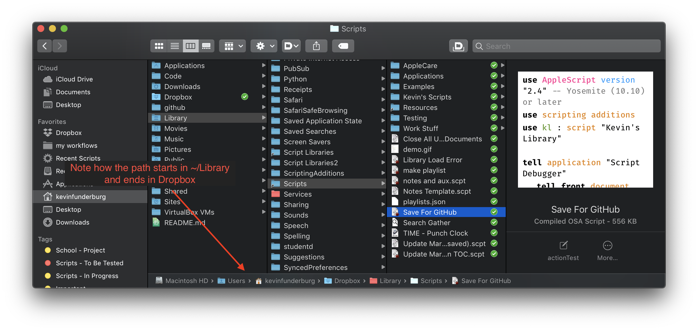

<p align="center">  </p>

# My AppleScripts

Collection of AppleScripts I've developed over the years for many purposes. Some are great as standalone scripts while others are great for incorporation with others.

> This repo is in continuous development and will be updated as scripts are developed (and as I have time).

<!-- TOC depthFrom:2 -->

- [About](#about)
- [Contents](#contents)
    - [Application Scripts](#application-scripts)
    - [Global Scripts](#global-scripts)
- [Tools](#tools)
- [Tips](#tips)
    - [Keep Scripts In Sync Using Aliases](#keep-scripts-in-sync-using-aliases)
        - [How to do it:](#how-to-do-it)
- [Licensing & thanks](#licensing--thanks)
- [Changelog](#changelog)
- [To-Do](#to-do)

<!-- /TOC -->

<a id="about"></a>

## About

These apps are mostly launched via [Keyboard Maestro][kmapp], [Alfred][alfredapp], [BetterTouchTool][bttapp], [Hazel][hazelapp].

Many of these apps depend on this [script library][kevinslib] I developed, so if you see this at the top of the script, make sure you get that library.

```AppleScript
use kl : script "Kevin's Library"
```

## Contents

I've divided the scripts into an applications section (scripts specific to an app) and a Global section where they can be used anywhere. Clicking the name of the script will show you the script directly, but **make sure to view the README for each section** by clicking the title of the section.

<a id="Applications"></a>

### Application Scripts

- [Alfred](./Alfred)
  - [Show Recent Files for Front App](./Alfred/Show%20Recent%20Files%20for%20Front%20App.applescript) 🌎
- [Finder][finder]
  - [Monthly Cleanups][2f34cbb7]
  - [Open Selection in iTerm](./Finder/Open%20Selection%20in%20iTerm.applescript)
- [Keyboard Maestro][km]
  - [Edit Linked or In-Line AppleScript][3034f6a6]
  - [Add|Remove Status Menu Trigger][8111e7c4]
  - [Copy Front Macros AppleScript Trigger](./Keyboard%20Maestro/Copy%20Front%20Macros%20AppleScript%20Trigger.applescript)
  - [Edit Last Executed Macro](./Keyboard%20Maestro/Edit%20Last%20Executed%20Macro.applescript) 🌎
  - [Go To Executed Macro](./Keyboard%20Maestro/Go%20To%20Executed%20Macro.applescript)
  - [Run Current Macro](./Keyboard%20Maestro/Run%20Current%20Macro.applescript) 🌎
- [Mail][mail]
  - [Set Color of Text][d1529523]
  - [Make Mail URL][63ba2f90]
  - [Mark All Inbox Messages as Read](./Mail/Mark%20All%20Inbox%20Messages%20as%20Read.applescript)
- [Safari](./Safari)
  - [Close Left Tab](./Safari/Close%20Left%20Tab.applescript)
  - [Close Right Tab](./Safari/Close%20Right%20Tab.applescript)
  - [Duplicate Tab](./Safari/Duplicate%20Tab.applescript)
  - [Do Javascript Handler](./Safari/Do%20Javascript%20Handler.applescript)
- [Script Debugger][sdb]
  - [Duplicate Tab][ff203baf]
  - [Duplicate for GitHub][ea9fb946]
  - [Insert Dynamic Handler Description](./Script%20Debugger/Insert%20Dynamic%20Handler%20Description.applescript)
  - [Open Used Script Libraries][3c961777]
  - [Run Front Script](./Script%20Debugger/Run%20Front%20Script.applescript) 🌎
  - [Save As Text Script][98e99d57]
  - [Toggle Minimal View][3a899b61]

[2f34cbb7]: ./Finder/Monthly%20Cleanups.applescript
[3034f6a6]: ./Keyboard%20Maestro/Edit%20Linked%20or%20In-Line%20AppleScript.applescript
[8111e7c4]: ./Keyboard%20Maestro/Add|Remove%20Status%20Menu%20Trigger.applescript
[d1529523]: ./Mail/Set%20Color%20of%20Text.applescript
[63ba2f90]: ./Mail/Make%20Mail%20URL.applescript
[ff203baf]: ./Script%20Debugger/Duplicate%20Tab.applescript
[ea9fb946]: ./Script%20Debugger/Duplicate%20for%20GitHub.applescript
[3c961777]: ./Script%20Debugger/Open%20Used%20Script%20Libraries.applescript
[98e99d57]: ./Script%20Debugger/Save%20As%20Text%20Script.applescript
[3a899b61]: ./Script%20Debugger/Toggle%20Minimal%20View.applescript

<a id="Various"></a>

### Global Scripts

- [Document Closers][docclosers]
  - [Close All Un-Saved Documents][9a704632]
  - [Close All With Saving][3b80a0d2]
  - [Close All Without Saving](./Document%20Closers/Close%20All%20Without%20Saving.applescript)
  - [Close With Saving](./Document%20Closers/Close%20With%20Saving.applescript)
  - [Close Without Saving](./Document%20Closers/Close%20Without%20Saving.applescript)
- [System Control][sc]
  - [Restart AirPort Extreme](./System%20Control/Restart%20AirPort%20Extreme.applescript)
  - [Toggle Bluetooth][25e6a902]
  - [Toggle Hazel][d2434bdc]
  - [Toggle Menu Bar Visibility][a517cb4f]
  - [Toggle WiFi](./System%20Control/Toggle%20WiFi.applescript)
- [Various][global]
  - [Click Script Menu][d1c0746f]
  - [Paste Safari URL With Title][1d8d603d]
  - [Start|Stop Quicktime Screen Recording][a921fa5d]
  - [Play|Pause Apple TV](./Global/Play|Pause%20Apple%20TV.applescript)

[9a704632]: ./Document%20Closers/Close%20All%20Un-Saved%20Documents.applescript
[3b80a0d2]: ./Document%20Closers/Close%20All%20With%20Saving.applescript
[25e6a902]: ./System%20Control/Toggle%20Bluetooth.applescript
[a517cb4f]: ./System%20Control/Toggle%20Menu%20Bar%20Visibility.applescript
[d2434bdc]: ./System%20Control/Toggle%20Hazel.applescript
[d1c0746f]: ./Global/Click%20Script%20Menu.applescript
[1d8d603d]: ./Global/Paste%20Safari%20URL%20With%20Title.applescript
[a921fa5d]: ./Global/Start|Stop%20Quicktime%20Screen%20Recording.applescript

---

## Tools

- [Script Debugger](https://latenightsw.com/) - By far the most valuable scripting tool. When I first started learning scripting with Script Editor, the process was slow and frustrating. With Script Debugger I learned 100 times faster and understood everything much easier.
- [UI Browser](https://pfiddlesoft.com/uibrowser/) - Invaluable tool for UI scripting. UI scripting is brutal on its own, and slightly less brutal with the Accessibility Inspector, but UI Browser makes it so much simpler, I tried it once and knew I had to get it.
- [JSON Helper](https://apps.apple.com/us/app/json-helper-for-applescript/id453114608?mt=12) - Makes working with JSON so much simpler, incredibly useful and free!
- [Location Helper](https://apps.apple.com/us/app/location-helper/id488536386?mt=12) - Find your geo code location in a snap, and for free!
- [Atom](https://atom.io/) plugins
  - [atom-applescript](https://github.com/franzheidl/atom-applescript) - adds language support to Atom so you can view AppleScript syntax
  - [build-osa](https://github.com/idleberg/atom-build-osa) - Lets you build and execute AppleScripts from Atom.

---

## Tips

### Keep Scripts In Sync Using Aliases

In order for scripts to be accessible via the Script Menu, scripts must be stored in `~/Library/Scripts`, but if you like to keep your scripts synced between devices, this location is a pain. I used to have a [Hazel][hazelapp] rule set up to sync `~/Library/Scripts` to Dropbox that worked fine for years, but I didn't like all the extra processing needed to sync and worse yet I had 2 copies of every script which was messy and got confusing.<br>
I realized later that moving all my scripts to `~/Dropbox/Library/Scripts` then creating an alias to that location and moving it `~/Library/Scripts` allows for my scripts to be stored in Dropbox, and still be accessible in the Script Menu! This method works exactly as well with the `~/Library/Script Libraries` folder. Here's a screenshot of what it looks like in Finder.



#### How to do it:

1.  **Make a backup** of the folder your moving to your Desktop just in case you mess up.
2.  I recommend having the same folder structure in Dropbox so make the folder `~/Dropbox/Library/`
3.  Copy the folder you want to sync (`~/Library/Scripts/`, `~/Library/Script Libraries/`) and paste into the `~/Dropbox/Library/` folder you made.
4.  Delete the original folder you copied from `~/Library/`
5.  Select the folder you pasted into `~/Dropbox/Library/` then click `File > Make Alias`
6.  Move the resulting alias back to `~/Library/`. The result will be like `~/Library/Scripts alias` so rename the alias by removing the "alias" part so it looks like `~/Library/Scripts` and you're good to go!

- **NOTE**: Symlinks don't work for this method, I originally tried the following command which did make an alias, but then the scripts weren't accessible via the Script Menu.


    ln -s ~/Library/Scripts ~/Dropbox/Library/Scripts/

---

## Licensing & thanks

These scripts are released under the [MIT License][mit].

<a id="changelog"></a>

## Changelog

- v1.0.0

## To-Do

- [ ] Add more app categories
- [ ] Refine readme
- [ ] Add icons to favorite scripts
- [ ] Add tips section

<!-- External links -->

[alfredapp]: https://www.alfredapp.com/
[bttapp]: https://folivora.ai/
[kmapp]: https://www.keyboardmaestro.com/
[hazelapp]: https://www.noodlesoft.com/

<!-- My GitHub links -->

[kevinslib]: https://github.com/kevin-funderburg/AppleScript-libraries/blob/master/Kevin's%20Library.applescript

<!-- Sub directories -->

[blob]: https://github.com/kevin-funderburg/AppleScripts/blob/master/
[docclosers]: https://github.com/kevin-funderburg/AppleScripts/tree/master/Document%20Closers
[finder]: https://github.com/kevin-funderburg/AppleScripts/tree/master/Finder
[global]: https://github.com/kevin-funderburg/AppleScripts/tree/master/Global
[km]: ./Keyboard%20Maestro
[mail]: https://github.com/kevin-funderburg/AppleScripts/tree/master/mail
[mit]: https://github.com/kevin-funderburg/AppleScripts/blob/master/LICENSE.txt
[sdb]: ./Script%20Debugger
[sc]: https://github.com/kevin-funderburg/AppleScripts/blob/master/System%20Control
