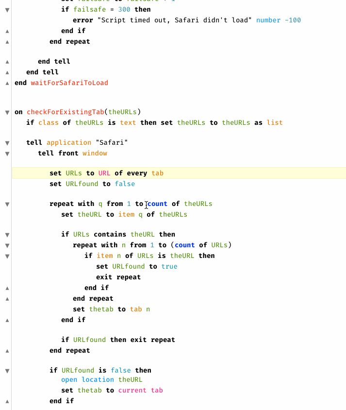

<p align="center">

</p>

# Script Debugger Scripts

Scripts and clippings for use when working in [Script Debugger][f2ac73e7].

> Although not needed, the shortcut keys I use to execute these via [Keyboard Maestro][kmapp] or [Alfred][alfredapp] are included in case you're interested

## Contents

- [Duplicate Tab][16321536]&emsp;<kbd>F7</kbd>
  - Duplicates the front tab, useful for making edits without breaking what is already written.

- [Handler Tester][9b6bdfdc]&emsp;<kbd>F6</kbd>
  - This creates a second script for unit testing handlers within a script.
  - Result looks something like this:
  
    ```AppleScript
    tell application "Script Debugger"
    tell document "Kevin's Library"
       waitForSafariToLoad()
     end tell
    end tell
    ```

- [Insert Dynamic Handler Description][hdnkas73]
  - Insert a handler description at the beginning of the handler currently selected. The description will inserted by creating a Script Debugger clipping _dynamically_ with the handler's name and parameters.
  - Check out the demo below.

    <p>

- [Open Used Script Libraries][k9g57d35]&emsp;<kbd>⌃</kbd><kbd>⌥</kbd><kbd>O</kbd>
  - Open the script libraries that are currently in use in the front script.

- [Run Front Script][f4s6h3f9]&emsp;<kbd>hyperkey</kbd><kbd>R</kbd>&emsp; :earth_americas:
  - Execute the frontmost script globally, I use this constantly for testing scripts in other applications.

- [Toggle Minimal View][e30bd9c8]&emsp;<kbd>⌘</kbd><kbd>⌥</kbd><kbd>⇧</kbd><kbd>M</kbd>
  - Hides/Shows the toolbar, sidebar, and logging panel.

- [My Clippings][ccf5a0a3]
  - Custom clippings I've made over the years. To use them save the `.txt` files into `~/Library/Application Support/Script Debugger 7/Clippings`

### File saving

- [Duplicate for GitHub][8474e70d]
  - This duplicates the front script in its current file location as a `.applescript` file with unix style line endings so it is readable on GitHub.

- [Save As Text Script][28c70107]&emsp;<kbd>⌃</kbd><kbd>S</kbd>
  - Prompts for a location to save a file as a text script with unix line endings for readability on GitHub.

- [Save a Copy of Front Script as Text][5ecfae32]&emsp;<kbd>⌃</kbd><kbd>S</kbd>
  - Same concept as the [Save As Text Script][28c70107] and [Duplicate for GitHub][8474e70d] but uses the command line to make sure a _copy_ of the front script is made. This is my favorite of the 3 for now because it works more consistently and makes saving `.applescript` files for these github posts way quicker


[f2ac73e7]: https://latenightsw.com/
[16321536]: ./Duplicate-Tab.applescript
[ccf5a0a3]: ./My-Clippings
[kmapp]: https://www.keyboardmaestro.com/
[alfredapp]: https://www.alfredapp.com/
[hdnkas73]: ./Insert-Dynamic-Handler-Description.applescript
[9b6bdfdc]: ./Handler-Tester.applescript
[8474e70d]: ./Duplicate-for-GitHub.applescript
[k9g57d35]: ./Open-Used-Script-Libraries.applescript
[f4s6h3f9]: ./Run-Front-Script.applescript
[28c70107]: ./Save-As-Text-Script.applescript
[5ecfae32]: ./Save-a-Copy-of-Front-Script-as-Text.applescript
[e30bd9c8]: ./Toggle-Minimal-View.applescript 