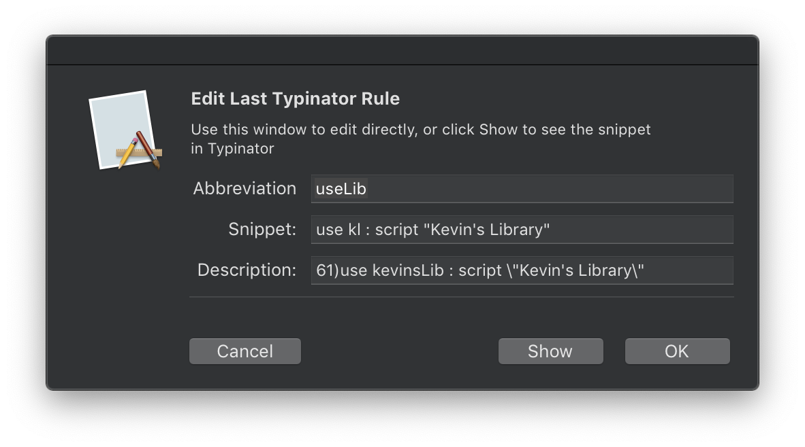

# Typinator Scripts

Various scripts for use with [Typinator][e44e5989].

## Contents

- [Edit Last Expanded Rule][e918395c]&emsp;<kbd>⌘</kbd><kbd>⌃</kbd><kbd>⌥</kbd><kbd>E</kbd>
  - Super useful if you want to make a change to the snippet or the abbreviation. This script is actually a `.scptd` file which is a script bundle, and within it is the wonderful library [Dialog Toolkit Plus][a1ea4d1d] which the script library it depends on to make the prompt. So if you want to run the scipt, download the [zip file][1db3d2aa], the link above is just for demonstration.
    

- [New Snippet from Clipboard or Selection][1172c96a]&emsp;<kbd>⌘</kbd><kbd>⌃</kbd><kbd>⌥</kbd><kbd>N</kbd>

[e44e5989]: https://www.ergonis.com/products/typinator/
[1db3d2aa]: ./Edit-Last-Expanded-Rule.zip
[a1ea4d1d]: https://www.macosxautomation.com/applescript/apps/Script_Libs.html#DialogToolkit
[e918395c]: ./Edit-Last-Expanded-Rule.applescript
[1172c96a]: ./New-Snippet-From-Selection|Clipboard.applescript
